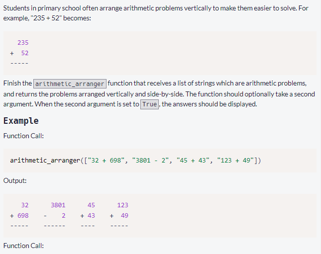
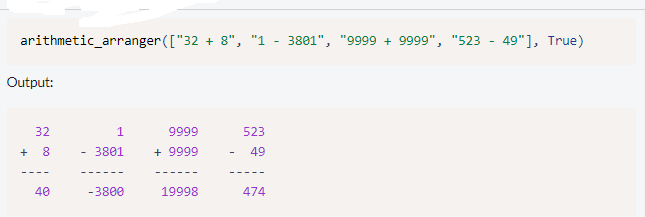
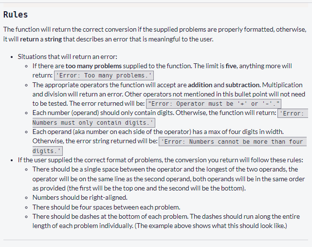

        <h1>Arithmetic Formatter</h1>
        <h3>Instructions</h3>
        

            
        

        

            
        

        

            
        

    

        To see full instruction visit <a href="https://www.freecodecamp.org/learn/scientific-computing-with-python/scientific-computing-with-python-projects/arithmetic-formatter">See More</a>
    

    
