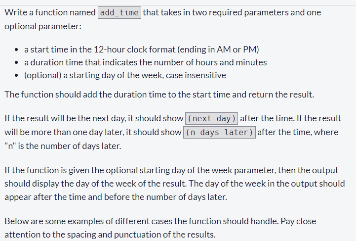
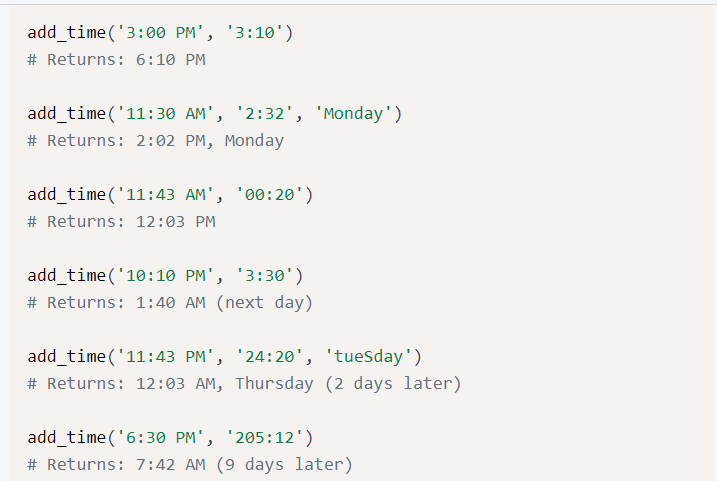

        <h1>Time Calculator</h1>
        <h3>Instructions</h3>
        

            
        

        

            
        

         
        

            <strong>To see more information <a href="https://www.freecodecamp.org/learn/scientific-computing-with-python/scientific-computing-with-python-projects/time-calculator">Click Here</a>
            </strong>
        

    

